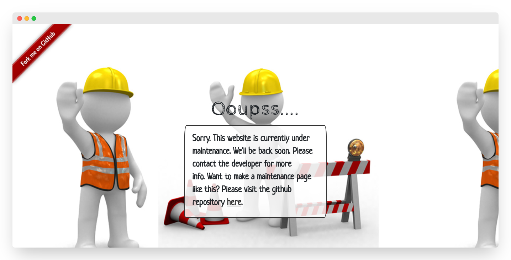

<h1>Welcome to Maintenance Page Template 👋</h1>

  

> Website page templates for website messages are currently under maintenance.

### ✨ [Demo](https://ihsandevs.me/maintenance_page)

## Author

👤 **Ihsan Devs**

- Website: https://dbapi.org
- Twitter: [@IhsanDevs](https://twitter.com/IhsanDevs)
- Github: [@IhsanDevs](https://github.com/IhsanDevs)
- LinkedIn: [@IhsanDevs](https://linkedin.com/in/IhsanDevs)

## Show your support

Give a ⭐️ if this project helped you!
